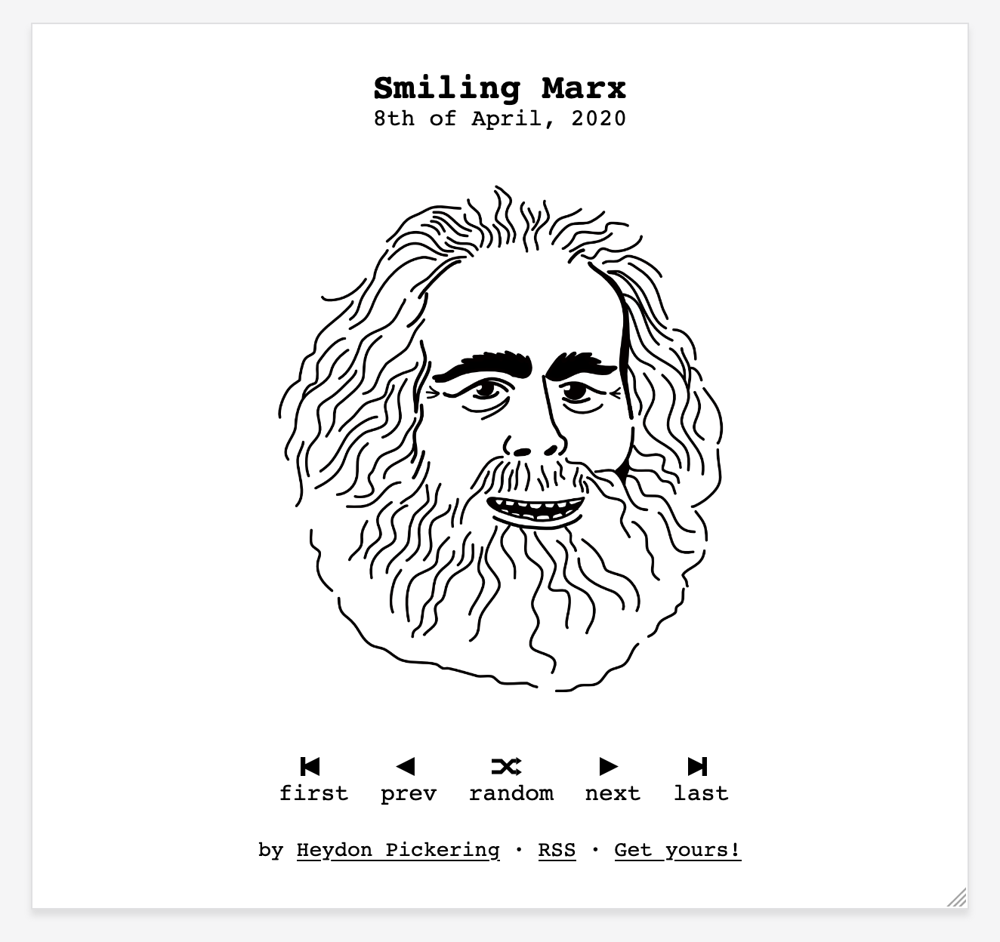

# Ga11ery

A minimal image sharing site kit, built with [11ty](https://www.11ty.dev/) and [NetlifyCMS](https://www.netlifycms.org/). Ideal for photography, illustration, and web comics. If you're more interested in sharing your creativity than messing around with host providers and complex website builders, **Ga11ery** is for you.

## Features

- Screen reader and keyboard accessible.
- Fully responsive.
- RSS enabled.
- Classic web comic style navigation, with "random" option.
- Tiny page weight (About 3.5KB, including the inlined CSS). Users download little more than the images themselves.

## Get started

### Step 1: Deploy

Deploy to Netlify, and follow the instructions. You will need to create a Netlify account if you don't have one.

### Step 2: Set up the CMS

The CMS is configured and ready to use. But first, you need to set up authentication. You can follow [Netlify's short guide](https://docs.netlify.com/visitor-access/identity/#enable-identity-in-the-ui) or the following steps (as found in the documentation for [Andy's Hylia starter kit](https://github.com/hankchizljaw/hylia):

- Once you’ve set up the site on Netlify, go to “Settings” > “Identity” and enable Identity.
- Scroll down to the “Git Gateway” area, click “Enable Git Gateway” and follow the steps.
- Click the “Identity” tab at the top.
- Once you’ve enabled identity, click “Invite Users”.
- Check the invite link in your inbox and click the link in the email that’s sent to you.
- Set a password in the popup box.
- Go to `/admin` on your site and login.
- You’re in and ready to edit your content!
- **IMPORTANT: make sure you change Settings > Site info > Site URL to match the Netlify domain/URL of your new site, or your custom domain if configured**

### Step 3: That's it!

Er... that's it!

## Version history

[0.1.0 Initial release](https://github.com/Heydon/ga11ery/releases/tag/0.1.0)

## Want to get writing instead?

**Ga11ery** is just for sharing images. If you want a writing/blogging starter kit, try [**Hylia**](https://github.com/hankchizljaw/hylia).

